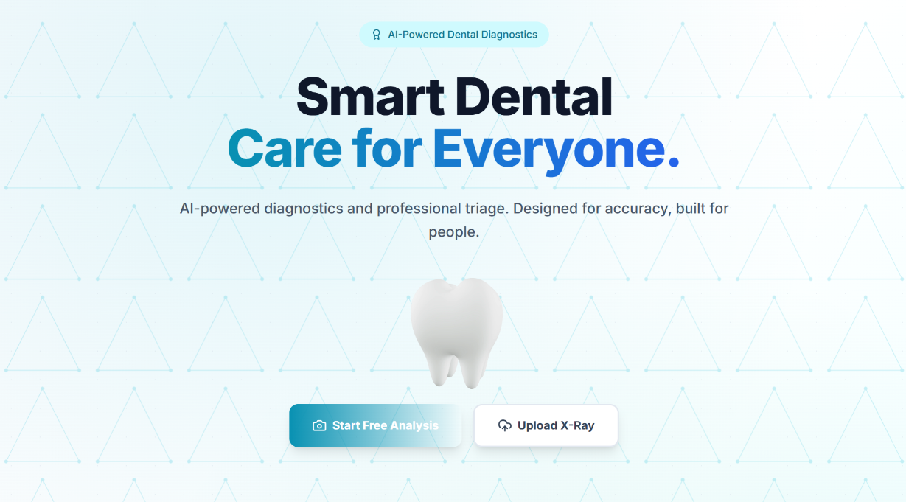
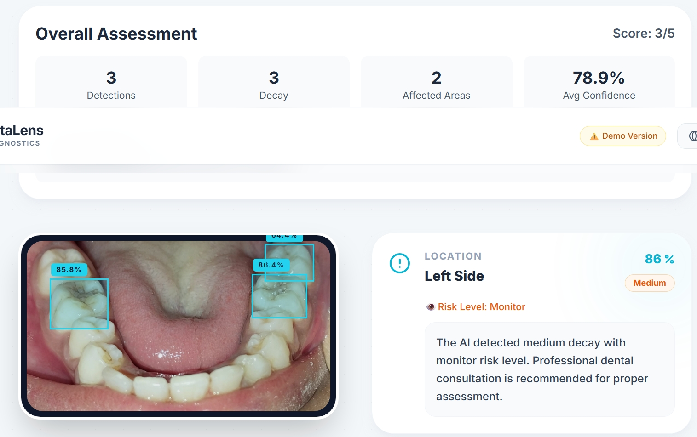
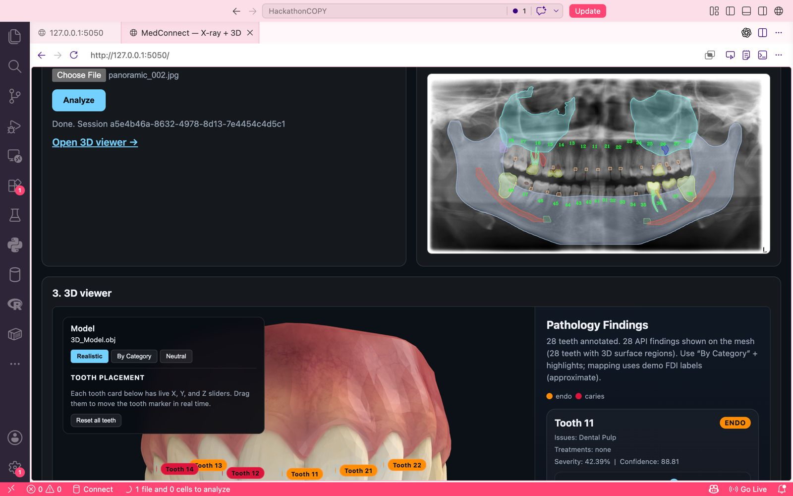
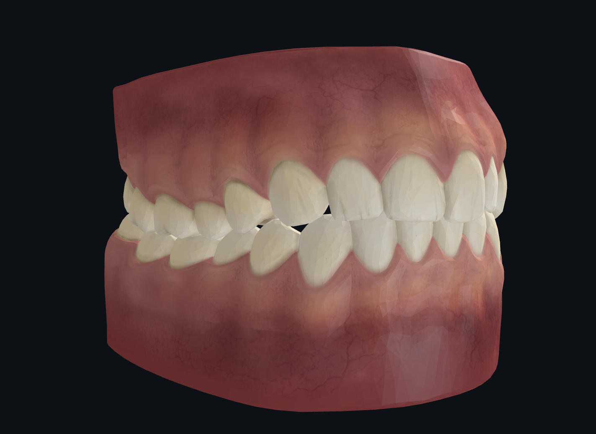
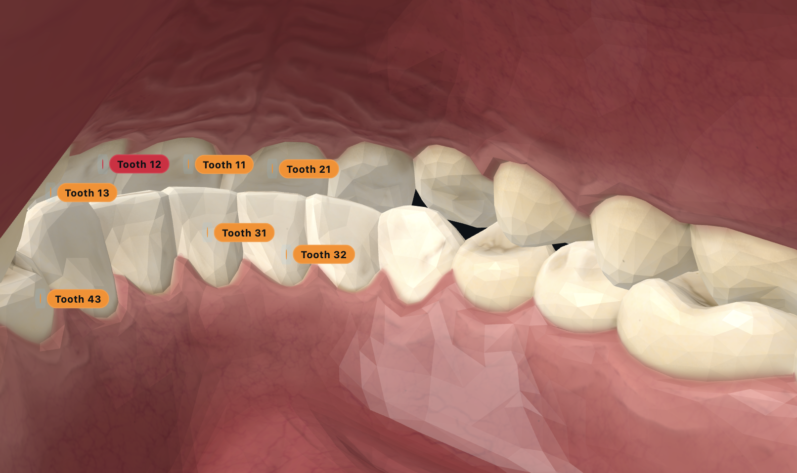

<div align="center">

# 🦷 DentaLens

### Smart Dental Care for Everyone

**From a selfie to a full AI-powered diagnosis — in seconds.**

[](https://python.org)
[](https://fastapi.tiangolo.com)
[](https://react.dev)
[](https://ultralytics.com)
[](LICENSE)


---

*🏆 3rd Place — MedConnect Hackathon 2026*

</div>

---

## Overview

DentaLens is a dual-path AI dental triage and analysis platform built in 48 hours for the MedConnect Hackathon. It addresses a simple but critical gap: **most dental AI tools assume you already have an X-ray**. DentaLens starts before the clinic — with just a phone.

| Path | Input | Output |
|------|-------|--------|
| **Path 1 — Selfie Triage** | mouth photo | Green / Yellow / Red urgency level |
| **Path 2 — X-Ray Analysis** | Dental radiograph (JPEG/PNG) | Full AI diagnosis + 3D model + costs + second opinion |

---


### Landing Page
> Two-path entry — selfie triage or X-ray upload. Trilingual (EN / FR / AR) 



---

**Path 1 — Selfie Triage**

- AI clinical triage: 🟢 Green / 🟡 Yellow / 🔴 Red
- Oral cancer early-warning flag
- Nearest X-ray imaging centers 
- Escalation path → Path 2 when X-ray is obtained





### Path 2 — X-Ray Analysis + 3D Viewer

**Path 2 — X-Ray Analysis**
- Zoomable annotated X-ray (pinch/scroll to inspect any region)
- Interactive 3D tooth model with per-pathology color coding
- VR mode (WebXR, one-flag enable)
- Progression timeline: untreated vs treated outcome per pathology
- Nearest dentists map 


> ThakaaMed API annotated overlay (left) and interactive 3D tooth model colored by pathology category (right). 28 teeth annotated, drag to orbit, click to inspect.



---

### 3D Model — Pathology View

> Real Blender OBJ mesh (14,417 polygons). Each tooth vertex-labeled by FDI number. API findings painted as radial color spots: caries in dark brown, endo in red, restorations in bright white.



---

### VR View — Inside the Mouth

> WebXR-compatible immersive view. The patient walks inside their own mouth. Tooth labels float in 3D space with pathology severity (orange = endo, red = caries).




---

## AI Stack

### ThakaaMed API (X-Ray Path)
Production dental AI used by real clinics. Per analysis:
- **191 AI models** run on every panoramic radiograph
- Detects: caries, bone loss, implants, restorations, prostheses, periapical pathologies, calculus, sinuses, condyles
- Returns per-tooth FDI numbering, bounding boxes, polygonal coordinates, and confidence scores (0–100)
- Supports: panoramic, periapical, bitewing, lateral cephalometric

### YOLOv8n — Custom Trained (X-Ray Path)
Trained from scratch on a clinical dental dataset:

| Metric | Score |
|--------|-------|
| mAP50 (overall) | **82.3%** |
| Decay (AP) | **91.6%** |
| Restoration (AP) | **73.0%** |
| Precision | 77.8% |
| Recall | 80.4% |

30 epochs · Tesla T4 GPU · 6.2 MB model · 2.2 ms inference

---


## Setup

### Prerequisites
- Python 3.10+
- Node.js 18+
- ThakaaMed API key + facility code 


### Backend

```bash
cd backend
python -m venv venv
source venv/bin/activate
pip install fastapi uvicorn python-multipart requests anthropic python-dotenv ultralytics pillow aiofiles
```

Create `backend/.env`:
```env
THAKAAMED_API_KEY=your_key
THAKAAMED_FACILITY=your_facility
```

```bash
uvicorn main:app --reload --port 8000
```


### Frontend

```bash
cd frontend
npm install
```

```bash
npm run dev
# Runs on http://localhost:5173
```

---

## Roadmap

- [ ] Oral cancer fine-tuned classifier 
- [ ] Darija voice assistant for rural accessibility
- [ ] Multi-scan longitudinal tracking with deterioration alerts
- [ ] Full VR activation for dental school training
- [ ] ThakaaMed commercial licence + clinic integrations

---

## Team

**Team23 — MedConnect Hackathon 2026**


***Alaa Belga***

***Aicha Laribia***

---

## Disclaimer

DentaLens is a hackathon prototype. The AI models used here are diagnostic-aid tools. No output should be used directly on patients without validation by a qualified dentist. Do not upload real patient data without explicit consent.

---

<div align="center">

**🦷 DentaLens** · MedConnect Hackathon 2026 · 3rd Place 🏆

*Making dental care understandable and accessible for everyone.*

</div>
